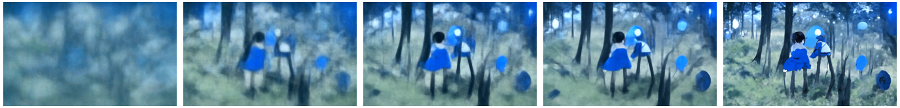

# Local-Disco-Diffusion-v5.2
A custom Disco Diffusion v5.2 that runs on local GPUS.


<p align = "center"></p>
<p align = "center"><b>Fig. 1: An image generated by Disco Diffusion v5.2 with the default prompt "A beautiful painting of a singular lighthouse, shining its light across a tumultuous sea of blood by greg rutkowski and thomas kinkade, Trending on artstation.".</b></p>


## Contents
1. [Background](#background)
2. [Install the Requirements](#install-the-requirement)
3. [Let's Disco](#lets-disco)
4. [Two Versions](#two-versions)


## Background
[Disco Diffusion (DD)](https://colab.research.google.com/github/alembics/disco-diffusion/blob/main/Disco_Diffusion.ipynb) is an open-source project that generates high-quality images from the given text description, which is also known as *prompt*. The technique used by DD is called CLIP-guided Diffusion, where the [CLIP](https://openai.com/blog/clip/) is an multi-modal pretrained model that connecting text and images, and [diffusion model](https://lilianweng.github.io/posts/2021-07-11-diffusion-models/) is a kind of generative model that iteratively update the image from Gaussian noise to a cleaner and more detailed version of the original one (Fig. 2). Combining the above two techniques, DD is then created by [Somnai](https://twitter.com/Somnai_dreams), augmented by [Gandamu](https://twitter.com/gandamu_ml), and building on the work of [RiversHaveWings](https://twitter.com/RiversHaveWings), [nshepperd](https://twitter.com/nshepperd1), and many other collaborators. A detailed introduction of Disco Diffusion can be found at [URL](https://docs.google.com/document/d/1l8s7uS2dGqjztYSjPpzlmXLjl5PM3IGkRWI3IiCuK7g/edit). A demo of Disco Diffusion can also be freely obtained, modified, and executed on [Colab](https://colab.research.google.com/github/alembics/disco-diffusion/blob/main/Disco_Diffusion.ipynb). 

However, free users have plenty of limitations and restraints on Google Colab. For those researchers, artists, or engineers who have their own high-performance GPUs, we provide a custom version of Disco Diffusion v5.2 project that runs on local machines, so we can better realize its full potentials.

<p align = "center"></p>
<p align = "center"><b>Fig. 2: an example of images generated at intermediate steps of the diffusion process using the prompt: "A girl and a boy meet each other in a forest under the stars from a Hayao Miyazaki animation."</b></p>


## Install the Requirement
```bash
###################################
###  Step by Step Installation   ##
###################################

# 1. create and activate conda environment
conda create -n disco_diffusion pip python=3.7
source activate disco_diffusion

# 2. install jupyter notebook
conda install jupyter notebook

# 3. generate jupyter config
jupyter notebook --generate-config

# 4. open "~/.jupyter/jupyter_notebook_config.py" and add the following three lines
c.NotebookApp.ip = 'YOUR_IP'
c.NotebookApp.open_browser=True
c.NotebookApp.password_required=True

# 5. set up the password of your jupyter notebook
jupyter notebook password

# 6. install conda packages
conda install pandas regex matplotlib

# 7. install pip packages
pip install opencv-python lpips datetime timm ftfy einops pytorch-lightning omegaconf
```


## Let's Disco

After install all the requirements, we can start to run the disco diffusion project. We can open the jupyter notebook on your local device by the following command:
```bash
# open jupyter notebook
jupyter notebook
```
then we can run the Local_Disco_Diffusion_v5_2.ipynb to generate your amazing images!

The text prompts can be gound at Section 3 in the notebook file. You can type multiple sentences to describe the image with the importance weight ":Number" at the end of each sentences like *["a realistic image of a ginger cat:2", "a beautiful kitchen:1"]*. 

More detailed instructions about the parameters of Disco Diffusion project can be found at [*Zippy's Disco Diffusion Cheatsheet v0.3*](https://docs.google.com/document/d/1l8s7uS2dGqjztYSjPpzlmXLjl5PM3IGkRWI3IiCuK7g/edit). To study the effect of different artists, we can see a summary of their painting styles at [*Disco Diffusion 70+ Artist Studies*](https://weirdwonderfulai.art/resources/disco-diffusion-70-plus-artist-studies/). Similarly, there are some popular [*Disco Diffusion Modifiers*](https://weirdwonderfulai.art/resources/disco-diffusion-modifiers/) that can be added as the end of the prompt for certain artistic effects.


## Two Versions
There are two versions of jupyter notebook files for the Disco Diffusion project.

1. The file [*Local_Disco_Diffusion_original_v5_2.ipynb*](https://github.com/KaihuaTang/Local-Disco-Diffusion-v5.2.jupyterNote/blob/main/Local_Disco_Diffusion_original_v5_2.ipynb) only has the necessary modifications with minimum changes. All functions are still kept in one single file just like the Colab version.

2. The file [*Local_Disco_Diffusion_v5_2.ipynb*](https://github.com/KaihuaTang/Local-Disco-Diffusion-v5.2.jupyterNote/blob/main/Local_Disco_Diffusion_v5_2.ipynb) puts all the functions in separate utils files, so it only contains the core function and all the parameters.